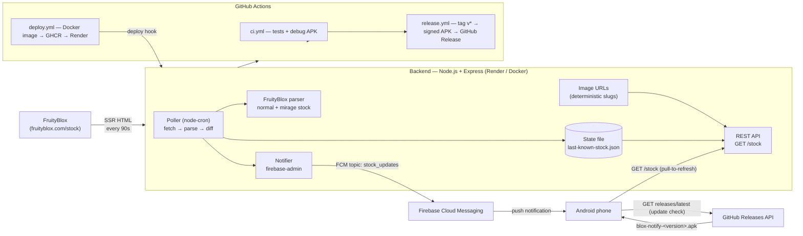
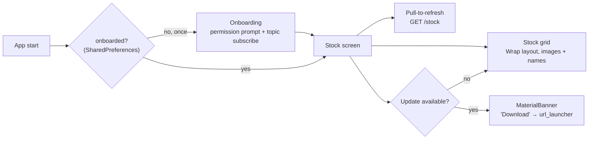
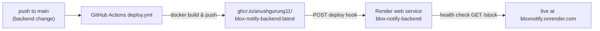

# Blox Notify

**Real-time Blox Fruits stock-change notifications for the Normal and Mirage dealers.**

Blox Notify watches the live stock on [FruityBlox](https://fruityblox.com/stock) (pulled automatically from the in-game shop — Normal dealer rotates every 4 hours, Mirage every 2 hours), detects every stock change, and pushes a notification to everyone who subscribed. An Android app shows the current stock with fruit images and countdowns, predicted next stock, a 30-day rotation history, a **trade calculator** that compares trades with fruit images and a clear win/loss verdict, and **live item values** (in-game + permanent) from game.guide.

> ⚠️ **Disclaimer**: Blox Notify is a fan-made utility. It is not affiliated with Gamer Robot Inc., the developers of Blox Fruits, or FruityBlox. Stock data comes from FruityBlox's live dealer feed.

---

## Table of Contents

1. [Architecture](#architecture)
2. [How the backend works](#1-backend--nodejs--express)
3. [How the Android app works](#2-android-app--flutter)
4. [How notifications flow](#how-a-stock-change-reaches-your-phone)
5. [Deployment & CI/CD](#deployment--cicd)
6. [How to release a new version](#releasing-a-new-version)
7. [Local development](#local-development)
8. [Testing](#testing)
9. [Configuration reference](#configuration-reference)
10. [Security notes](#security-notes)
11. [Limitations](#limitations)
12. [Project structure](#project-structure)

---

## Architecture



**Data flow in one sentence:** FruityBlox pulls the dealer stock straight from the game → the backend polls, parses, diffs and broadcasts → Firebase fans the message out to every subscribed device → the app renders the stock and keeps itself up to date from GitHub Releases.

---

## 1. Backend (Node.js + Express)

A dependency-light CommonJS service (`backend/`) that does one job: *watch the live dealer stock, and tell the world when it changes.*

### The polling pipeline (`src/poller.js`)

Every **90 seconds** (configurable via `POLL_INTERVAL_MS`) `node-cron` runs one cycle:

| Stage | Module | What happens |
|---|---|---|
| **Fetch** | `src/fruitybloxClient.js` | `GET https://fruityblox.com/stock` (a Next.js SSR page — no public API). Stock is pulled automatically from the in-game shop, so it updates live at each rotation instead of waiting for wiki editors |
| **Parse** | `src/fruitybloxClient.js` | Extracts the `normal` and `mirage` dealer stock from the page's embedded Next.js payload (with a rendered-DOM fallback), e.g. `normal: [Rocket, Spin, ...]`, `mirage: [Rocket, Gas, ...]` |
| **Diff** | `src/stockStore.js` | Compares both dealer lists against the last-known stock persisted in `data/last-known-stock.json` |
| **Notify** | `src/notifier.js` | For each dealer that changed, sends an FCM topic broadcast (see below) |
| **Persist** | `src/stockStore.js` | Writes the new stock + timestamp to the state file and pushes the previous snapshot onto `history` (kept for **30 days**, newest first, hard-capped at 750) |

Safety guard: if a poll parses an **empty** stock, the cycle is aborted instead of treating it as a change (protects against transient site failures).

### Keeping the poller alive (Render free tier)

Render's **free** web services spin down after 15 minutes without inbound traffic. While spun down the cron loop does not run, so a stock change is only noticed when a request wakes the service — which is why notifications may have gone missing.

Two things fix this:

1. The service now exposes **`GET /health`** (returns `200 {"ok":true}`) as a dedicated liveness endpoint.
2. Point a **free uptime monitor at it** — e.g. [UptimeRobot](https://uptimerobot.com/) (free: 50 monitors, 5-minute interval). Each ping counts as inbound traffic and prevents spin-down, so the service polls 24/7 and notifications fire on time. (Render's own health-check pings do *not* count as activity.)

### Fruit images (`src/fruitImages.js`)

Fruit icons are served by FruityBlox at deterministic slug URLs (`https://fruityblox.com/images/fruits/<slug>.webp`) — no API call or cache needed. Unknown fruits fall back to `null` and the app shows a placeholder, never a wrong image.

### REST API

| Endpoint | Response |
|---|---|
| `GET /health` | `{ "ok": true }` — liveness endpoint for the keep-alive pinger |
| `GET /stock` | `{ "normal": { "fruits": [ { "name": "Spring", "imageUrl": "..." }, ... ], "updatedAt": "ISO-8601", "nextResetAt": "epoch-ms" }, "mirage": { ... }, "fruits": <normal alias>, "updatedAt": ..., "history": [ { "fruits": [...], "mirageFruits": [...], "updatedAt": "ISO-8601" }, ... ] }` — last known stock for both dealers enriched with image URLs, next reset times (normal: 4h, mirage: 2h, UTC-aligned), plus a preview of the 50 most recent snapshots (newest first) |
| `GET /stock/history` | `{ "ready": true, "source": "bloxvalues" | "local", "updatedAt": "epoch-ms", "events": [ { "type": "Normal" | "Mirage", "timestamp": "unix-s", "time": "ISO-8601", "items": [ { "name": "Dough", "imageUrl": "...", "price": 3500000, "robux": 0, "url": "..." }, ... ] }, ... ] }` — the **full 30-day rotation history** as events (each a Normal or Mirage dealer restock with its fruits, prices and images), sourced from the bloxvalues.net stock-history file when available and falling back to local snapshots; `{ "ready": false }` when nothing is available |
| `GET /stock/predictions` | `{ "ready": true, "nextResetAt": "epoch-ms", "predictions": [ { "name": "Dough", "confidence": 0.12, "imageUrl": "...", "rarity": "Mythical" }, ... ], "rating": { "top1Accuracy": 32.3, "top3Accuracy": 63.2, "testedRotations": 10972 } }` — predicted fruits for the next rotation: the model's top-3 plus up to two Legendary/Mythical picks surfaced from the live value list (each with image and rarity); `{ "ready": false }` before the history model is loaded |
| `GET /values` | `{ "ready": true, "updatedAt": "epoch-ms", "items": [ { "id": 16, "name": "Dough", "normalValue": 30000000, "permanentValue": 3580000000, "demand": "Very High", "trend": "Overpaid", "category": "Fruits", "rarity": "Mythical", "fruitType": "Logia", "imageUrl": "..." }, ... ] }` — live values for all tradable items (fruits, gamepasses, limiteds) scraped from game.guide, cached for 10 minutes; `{ "ready": false }` when nothing is cached yet |

The health check used by Render points at `GET /health`.

### Stock prediction (`src/historyParser.js`, `src/predictor.js`)

Blox Notify predicts the **next stock rotation**. It parses the wiki's
[History of Stock](https://blox-fruits.fandom.com/wiki/History_of_Stock) pages
(10,000+ recorded rotations since 2020, fetched at boot and every 6h — the wiki
is used here because FruityBlox only exposes current stock), then
scores every fruit as a blend of:

- **slot affinity** — how often the fruit appears in the target UTC slot
  (rotations happen at fixed 00:00/04:00/08:00/12:00/16:00/20:00 UTC), and
- **transition affinity** — how often the fruit followed a rotation containing
  each of the currently-stocked fruits.

Fruits already in stock are excluded. The **rating** is a strict walk-forward
backtest — every rotation is predicted using only the data before it — so the
displayed accuracy (32.3% top-1 / 63.2% top-3 over 10,972 rotations) is what
the model actually achieved, not a fitted figure. Predictions are
entertainment/utility, not guaranteed.

### Live item values (`src/valuesClient.js`, `src/routes/values.js`)

The in-game trade value changes over time. `GET /values` serves the **live value list** scraped from
[game.guide's Blox Fruits value list](https://www.game.guide/blox-fruits-value-list)
(Next.js flight-payload parsing, with a rendered-DOM card fallback): in-game
value, **permanent** value (the trade value of the permanent version of the
item, in the same in-game units — game.guide's "Perm" column), demand
(Very High → Very Low), trend, category (Fruits/Gamepasses/Limiteds), rarity
and image for ~85 items. The list is cached in memory for 10 minutes to avoid
hammering the site; when a refetch fails the last good list is still served.
The same list feeds the trade calculator and surfaces Legendary/Mythical
fruits in the predictions.

### Stock history (`src/stockHistoryClient.js`, `src/routes/stock.js`)

`GET /stock/history` serves the **full 30-day rotation history** for the app's
History screen. The primary source is the
[bloxvalues.net stock history](https://bloxvalues.net/blox-fruit-stock/blox-fruit-stock-history/),
whose public JSON file (`stock_history.json`) records every Normal and Mirage
restock with timestamps, fruit images and Beli prices; it is fetched at boot
and cached for 30 minutes (stale-served on failure, with a fallback to the
backend's own poller snapshots when the remote source is unreachable). Local
snapshots are retained for 30 days (pruned by age, hard-capped at 750) so the
same endpoint works even if bloxvalues is down.

### Notifications (`src/notifier.js`)

Uses `firebase-admin` to publish a **topic message** to the `stock_updates` topic (configurable via `FCM_TOPIC`) — one message per dealer that changed:

- Normal dealer: title `Stock Updated!`; Mirage dealer: title `Mirage Stock Updated!` (payload carries `dealer: "normal" | "mirage"`)
- Data payload: `fruits` (comma-separated names) and `imageUrls` (the new stock's fruit images, JSON)
- The app renders a **big-picture notification** with the first fruit's image

Topics mean the backend does **not** need to know individual device tokens — any device that subscribed to the topic receives the push.

### Resilience

- Poll failures are caught and logged per cycle; the loop keeps running.
- If Firebase credentials are missing, the backend logs a warning and serves the API normally (notifications skipped until configured).
- The HTTP server binds `0.0.0.0` (a plain `listen(PORT)` on Node can bind IPv6-only and break Render health checks).

### Environment variables

| Variable | Default | Purpose |
|---|---|---|
| `PORT` | `3000` | HTTP port (Render injects this) |
| `POLL_INTERVAL_MS` | `90000` | Wiki poll interval |
| `FCM_TOPIC` | `stock_updates` | FCM topic to broadcast on |
| `STOCK_FILE` | `data/last-known-stock.json` | State file path |
| `FIREBASE_SERVICE_ACCOUNT` | — | Inline service-account JSON |
| `FIREBASE_SERVICE_ACCOUNT_FILE` | — | Path to the service-account JSON file (local dev) |
| `VALUES_URL` | `https://www.game.guide/blox-fruits-value-list` | game.guide value list page |

---

## 2. Android app (Flutter)

A single-package app (`com.bloxnotify.blox_notify`, minSdk 23, Android-only in v1).

### Screens & flow



1. **Onboarding** (`lib/screens/onboarding_screen.dart`) — explains the app, requests notification permission, then subscribes the device to the FCM `stock_updates` topic via `firebase_messaging`. The "done" flag is persisted with `shared_preferences`, so the prompt shows **exactly once, ever** — not on every launch.
2. **Stock screen** (`lib/screens/stock_screen.dart`) — fetches `GET {apiBase}/stock`, renders the current stock for the Normal and Mirage dealers as a **Wrap grid** (72px fruit tiles that flow onto the next row instead of scrolling sideways) with countdowns to the next rotation, and supports pull-to-refresh. A **MaterialBanner** appears when a newer APK exists; tapping *Download* opens the GitHub Release asset in the browser via `url_launcher`.
3. **Trade calculator** (`lib/screens/trade_screen.dart`) — simulates an in-game trade: pick items (live values from `GET /values`) for the "you give" and "you receive" sides. Selected items are shown as a **grid of fruit image tiles** (tap to remove); totals are compared and a **Win/Loss verdict with the exact amount gained or lost** updates in real time.
4. **Values screen** (`lib/screens/values_screen.dart`) — the live game.guide list in a **grid layout**: search, category and **rarity filters** (Common/Uncommon/Rare/Legendary/Mythical), in-game and permanent ("Perm") values, demand badges (Very High → Very Low), trend, rarity and images.
5. **Predictions screen** (`lib/screens/predictions_screen.dart`) — the predicted next stock: top-3 candidates with confidence bars plus Legendary/Mythical picks surfaced from the live value list (rarity badges), the model's backtested rating and a countdown to the next rotation.
6. **History screen** (`lib/screens/history_screen.dart`) — the **last 30 days of restocks** in the style of the bloxvalues history page: a "Most Frequent Fruits" leaderboard (count + last seen), then day-grouped restocks with **Normal/Mirage dealer badges**, 12-hour local times and fruit chips with images and Beli prices (falling back to FruityBlox slugs + letter avatars).
7. **Background handling** (`lib/services/fcm_service.dart`) — a top-level background handler converts incoming FCM messages into a **big-picture notification** (first fruit image + changed list) using `flutter_local_notifications`, so a change is visible even with the app closed. A `PushService` abstraction keeps the UI testable.

### Launcher icon

A custom Blox Fruits-style icon (devil fruit on a dark navy tile, generated from `assets/icon/icon.png` + `assets/icon/icon_foreground.png`) is applied to all mipmap densities and as an adaptive icon (`adaptive_icon_background: "#121628"`) via `flutter_launcher_icons`.

### Update check (`lib/services/update_service.dart`)

The app self-updates *without Play Store*:

1. On the stock screen, it calls `GET https://api.github.com/repos/AnushGurung11/BloxNotify/releases/latest` (falling back silently on any error).
2. It looks for an asset matching the contract `blox-notify-<versionName>+<versionCode>.apk`.
3. If the release's versionCode is **greater** than the installed `buildNumber` (from `package_info_plus`), the update banner shows.

> **Contract**: every release must publish the APK with this exact filename. The release workflow enforces it automatically.

### Configuration (`lib/config.dart`)

- `apiBaseUrl` — default `https://bloxnotify.onrender.com`, overridable at build time with `--dart-define=API_BASE_URL=...`
- `fcmTopic` — `stock_updates`

### Signing

Release builds are signed with a dedicated keystore (`app/android/app/release.keystore`, CN=Blox Notify). `build.gradle.kts` reads credentials from `ANDROID_STORE_FILE` / `ANDROID_STORE_PASSWORD` / `ANDROID_KEY_ALIAS` / `ANDROID_KEY_PASSWORD` env vars, or from the gitignored `app/android/key.properties` (local dev), and falls back to the debug keystore when neither is present.

---

## How a stock change reaches your phone

```
FruityBlox pulls the dealer stock from the game
        │
        ▼
Backend poll (every 90s) ──► parse normal + mirage ──► differs from last-known?
        │                                        │
        │ no: log "stock unchanged"              │ yes (per dealer)
        ▼                                        ▼
   wait 90s                            persist new stock + append
                                           previous stock to history
                                           │
                                           ▼
                                 FCM topic message "stock_updates"
                                           │
                                           ▼
                                 Every subscribed device shows the
                                 "Stock Updated!" (or "Mirage Stock
                                 Updated!") push — delivered by the
                                 Android system itself, so it arrives
                                 even with the app closed or
                                 force-stopped (no background service
                                 needed)
```

The end-to-end latency is the poll interval: **at most ~90 seconds** after FruityBlox's feed reflects the new stock. When the app is in the foreground/background the big-picture notification is rendered by the app; when it is terminated the system shows the standard notification from the push payload.

---

## Deployment & CI/CD

The project ships via three GitHub Actions workflows plus Render:

| Workflow | Triggers | What it does |
|---|---|---|
| `ci.yml` | push/PR to `main` | Backend Jest tests, `flutter analyze` + `flutter test`, and (if the `GOOGLE_SERVICES_JSON` secret exists) a debug APK artifact |
| `deploy.yml` | push to `main` touching `backend/**` or `deploy.yml`, manual dispatch | Builds the Docker image, pushes to **GHCR** as `ghcr.io/anushgurung11/blox-notify-backend:latest` (+ `:<sha>`), then calls the Render deploy hook to redeploy |
| `release.yml` | push of tag `v*`, manual dispatch | Builds the **signed release APK** with the live API URL baked in, renames it `blox-notify-<name>+<code>.apk`, publishes a **GitHub Release** with auto-generated notes |

### The deploy chain



Notes:

- **GHCR image names must be lowercase.** The workflow computes `ghcr.io/${GITHUB_REPOSITORY_OWNER}/blox-notify-backend` and lowercases it in bash (`${VAR,,}`) — expression functions can't be relied on for this.
- The Render service is defined in `render.yaml` (Blueprint) as an **image** runtime pulling the GHCR tag, with `FIREBASE_SERVICE_ACCOUNT` as a manually-synced secret env var (`sync: false`).
- **Keep the free instance awake:** set up a free [UptimeRobot](https://uptimerobot.com/) monitor (HTTP(s), 5-minute interval) on `https://bloxnotify.onrender.com/health`. Without it the service spins down after 15 idle minutes and the stock poller — and thus notifications — stops.
- Secrets **cannot** be referenced in `if:` conditions — not at step level, and not at job level. All workflow secrets are mapped to job-level `env:` vars and checked with `if: ${{ env.X != '' }}`.

### Required GitHub secrets

| Secret | Value |
|---|---|
| `GOOGLE_SERVICES_JSON` | base64 of `app/android/app/google-services.json` (single line) |
| `ANDROID_KEYSTORE_BASE64` | base64 of `app/android/app/release.keystore` |
| `ANDROID_STORE_PASSWORD` | keystore store password |
| `ANDROID_KEY_PASSWORD` | keystore key password |
| `ANDROID_KEY_ALIAS` | `blox-notify` |
| `RENDER_DEPLOY_HOOK_URL` | Render service deploy hook URL |

---

## Releasing a new version

1. Bump the version in `app/pubspec.yaml` — e.g. `version: 1.0.1+2` (name+buildCode).
2. Commit and push to `main`.
3. Tag and push:
   ```bash
   git tag v1.0.1
   git push origin v1.0.1
   ```
4. `release.yml` builds the signed APK (`--dart-define=API_BASE_URL=https://bloxnotify.onrender.com`), publishes it as a GitHub Release.
5. Every installed app with an older versionCode shows the **update banner** on the next open and downloads the new APK directly from the release.

> The tag *must* be pushed to the same commit that contains the new `pubspec.yaml` version — the workflow reads the version from the checked-out file.

---

## Local development

### Backend

```bash
cd backend
npm install
cp .env.example .env          # set FIREBASE_SERVICE_ACCOUNT_FILE=./secrets/<your-key>.json
npm run dev                   # or npm start
curl http://localhost:3000/stock
curl http://localhost:3000/values
npm run verify:stock          # one-off: fetch + parse the live FruityBlox stock
npm run verify:values         # one-off: fetch + parse the live game.guide value list
```

### App

```bash
cd app
flutter pub get
flutter run                   # uses https://bloxnotify.onrender.com by default
# point at a local backend:
flutter run --dart-define=API_BASE_URL=http://10.0.2.2:3000
```

---

## Testing

| Suite | Command | Coverage |
|---|---|---|
| Backend (Jest + Supertest) | `cd backend && npm test` | 92 tests — FruityBlox client (payload + DOM parsing, reset times), poller diff/notify logic (both dealers), **30-day history pruning + hard cap**, stock store (incl. legacy migration), `/stock` + `/health` routes, **`/stock/history` route (bloxvalues source, local fallback, empty state)**, **bloxvalues history client (parse/normalize, cache/TTL, stale serving)**, history parser (wiki tables), predictor (backtest + slots + rarities), predictions route (rarity enrichment), value client (flight-payload + card fallback parsing, cache/TTL, stale serving) + `/values` route, notifier, cron conversion |
| App (Flutter) | `cd app && flutter test` | 33 tests — stock grid + countdowns, 12-hour time formatting, predictions (rarity badges, no Best Times), **trade calculator (image-tile grid, add/remove/clear, Win/Loss verdict without progress bar)**, **values screen (grid, search, category + rarity filters, Perm label)**, **history screen (day groups, dealer badges, leaderboard, prices)**, API service, FCM service, onboarding, update service + banner logic |
| App static analysis | `cd app && flutter analyze` | zero issues |
| E2E (emulator) | `cd app && flutter test integration_test` | full app flow on a real Android emulator (5 tabs) |

CI runs the backend and Flutter suites on every push.

---

## Security notes

- All credentials live in **gitignored** locations: `backend/secrets/`, `app/android/app/google-services.json`, `app/android/app/release.keystore`, `app/android/key.properties`, any `.b64` exports, `.env` files.
- Secrets never appear in workflow files; they're referenced by name only.
- The keystore password is a generated 24-char random string, unique to this project.
- If a secret ever ends up in git history, rotate it (regenerate the Render deploy hook, re-download `google-services.json` from Firebase console, or regenerate the keystore).
- `release.keystore` is your only way to sign updates — back it up (`release.keystore.b64`) and keep the password safe. Losing it means changing the app's identity.

---

## Limitations

- **The poller needs the service to stay awake.** On Render's free plan, add a keep-alive ping (`GET /health`) so the 15-minute idle spin-down never happens — see [Keeping the poller alive](#keeping-the-poller-alive-render-free-tier).
- The backend state file (current stock **and** local snapshots) lives inside the container and resets on redeploy. On restart the backend seeds the current stock silently (no notification spam). The History screen still shows the full 30-day window because it is served from the remote bloxvalues.net history (see [Stock history](#stock-history-srchistoryclientjs-srcroutesstockjs)); local snapshots are only a fallback. Persisting local state across redeploys requires a Render disk (paid plans).
- **Predictions are a statistical guess** (community-recorded wiki history, not the game's RNG) — the in-app rating shows the model's real backtested accuracy.
- **Values are best-effort** — game.guide is scraped (flight-payload parsing with a DOM fallback) and cached for 10 minutes; if game.guide changes layout or is unreachable, the app shows the last known list or a retry state.
- The Normal dealer's stock rotates every 4 hours and the Mirage dealer every 2 hours — notifications fire within ~90s of FruityBlox reflecting the new stock, at the rotation boundary.
- Android-only for now (no iOS build), distributed via GitHub Releases — not on the Play Store.
- One notification per dealer change (topic broadcast) — no per-user accounts or preferences yet.

---

## Project structure

```
├── backend/                     # Node.js + Express poller service
│   ├── src/
│   │   ├── index.js             # entry: env, credentials, start polling
│   │   ├── app.js               # Express app factory (testable, no side effects)
│   │   ├── fruitybloxClient.js  # live stock scrape (normal + mirage + reset times)
│   │   ├── valuesClient.js      # game.guide live value list (payload + DOM fallback, 10-min cache)
│   │   ├── wikiClient.js        # MediaWiki API client (history pages only)
│   │   ├── stockStore.js        # state file read/write (both dealers + history)
│   │   ├── poller.js            # node-cron loop + diff + notify
│   │   ├── notifier.js          # FCM topic broadcasts (per dealer)
│   │   ├── fruitImages.js       # deterministic FruityBlox image URLs
│   │   ├── historyClient.js     # History of Stock pages fetch
│   │   ├── stockHistoryClient.js # bloxvalues.net 30-day stock history (JSON fetch + cache)
│   │   ├── historyParser.js     # wiki tables → rotation entries
│   │   ├── predictor.js         # slot/transition model + backtest + rarity picks
│   │   ├── stockPredictor.js    # cached predictor service (6h refresh)
│   │   ├── routes/stock.js      # GET /stock (both dealers + next reset + history) + GET /stock/history
│   │   ├── routes/predictions.js # GET /stock/predictions (images + rarities)
│   │   └── routes/values.js     # GET /values (live trade values)
│   ├── scripts/verify-stock.js  # one-off live FruityBlox check
│   ├── scripts/verify-history.js # one-off history parse + backtest report
│   ├── scripts/verify-values.js # one-off live game.guide value list check
│   ├── data/                    # last-known-stock.json (runtime)
│   ├── secrets/                 # firebase service account (gitignored)
│   ├── Dockerfile               # multi-stage node:22-alpine
│   └── test/                    # 92 Jest tests
├── app/                         # Flutter Android app
│   ├── assets/icon/             # launcher icon masters (generated)
│   ├── lib/
│   │   ├── main.dart            # wiring, 5-tab navigation, one-time onboarding flag
│   │   ├── config.dart          # API base URL, FCM topic
│   │   ├── models/fruit.dart    # Fruit + StockSnapshot (+ history)
│   │   ├── models/value.dart    # ValueItem + value formatting
│   │   ├── models/history.dart  # StockHistory events/items + Beli formatting
│   │   ├── screens/onboarding_screen.dart
│   │   ├── screens/stock_screen.dart        # stock grid (Wrap) + update banner
│   │   ├── screens/trade_screen.dart        # trade calculator (image grid, Win/Loss verdict)
│   │   ├── screens/values_screen.dart       # values grid, demand/rarity, search/filters
│   │   ├── screens/predictions_screen.dart  # predictions + rarity badges
│   │   ├── screens/history_screen.dart      # 30-day history: leaderboard + day groups
│   │   ├── utils/fruit_images.dart          # FruityBlox slug URL + initial fallback
│   │   └── services/            # stock_api, fcm_service, update_service
│   ├── android/app/
│   │   ├── google-services.json # (gitignored)
│   │   ├── release.keystore     # (gitignored)
│   │   └── build.gradle.kts     # signing, conditional google-services plugin
│   ├── test/ + integration_test/
├── .github/workflows/
│   ├── ci.yml                   # tests + debug APK
│   ├── deploy.yml               # GHCR + Render hook
│   └── release.yml              # tag v* → signed APK → GitHub Release
├── render.yaml                  # Render Blueprint (image runtime)
├── project.md                   # original spec
└── VISION.md                    # private future-vision doc (gitignored)
```
