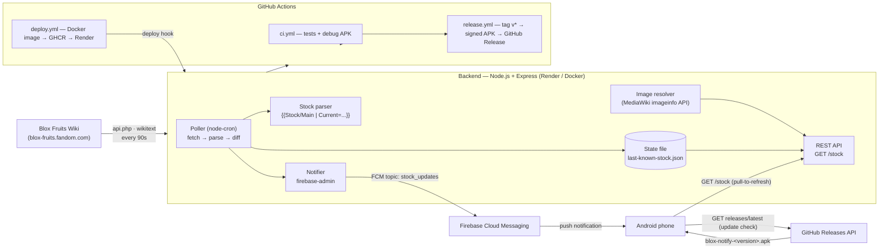
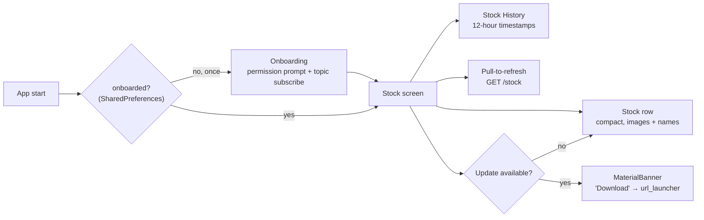
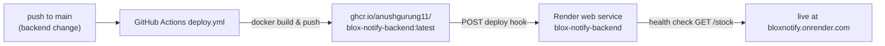

# Blox Notify

**Real-time Blox Fruits stock-change notifications, straight from the wiki to your phone.**

Blox Notify watches the [Blox Fruits wiki stock page](https://blox-fruits.fandom.com/wiki/Blox_Fruits_%22Stock%22), detects every time the current stock of fruits changes, and pushes a notification to everyone who subscribed — within seconds of the wiki being updated. An Android app shows the current stock with fruit images and a banner when a newer version is available.

> ⚠️ **Disclaimer**: Blox Notify is a fan-made utility. It is not affiliated with Gamer Robot Inc., the developers of Blox Fruits, or Fandom. Notification speed depends on how quickly wiki editors update the stock page.

---

## Table of Contents

1. [Architecture](#architecture)
2. [How the backend works](#1-backend--nodejs--express)
3. [How the Android app works](#2-android-app--flutter)
4. [How notifications flow](#how-a-stock-change-reaches-your-phone)
5. [Deployment & CI/CD](#deployment--cicd)
6. [How to release a new version](#releasing-a-new-version)
7. [Local development](#local-development)
8. [Testing](#testing)
9. [Configuration reference](#configuration-reference)
10. [Security notes](#security-notes)
11. [Limitations](#limitations)
12. [Project structure](#project-structure)

---

## Architecture



**Data flow in one sentence:** the wiki is a community-edited source of truth → the backend polls, parses, diffs and broadcasts → Firebase fans the message out to every subscribed device → the app renders the stock and keeps itself up to date from GitHub Releases.

---

## 1. Backend (Node.js + Express)

A dependency-light CommonJS service (`backend/`) that does one job: *watch the wiki, and tell the world when stock changes.*

### The polling pipeline (`src/poller.js`)

Every **90 seconds** (configurable via `POLL_INTERVAL_MS`) `node-cron` runs one cycle:

| Stage | Module | What happens |
|---|---|---|
| **Fetch** | `src/wikiClient.js` | `GET https://blox-fruits.fandom.com/api.php?action=parse&page=Blox_Fruits_%22Stock%22&prop=wikitext&format=json` |
| **Parse** | `src/stockParser.js` | Extracts the `Current` field from the `{{Stock/Main |Current = ...}}` template via regex, e.g. `Spring, Flame, Light` → `["Spring", "Flame", "Light"]` |
| **Diff** | `src/stockStore.js` | Compares against the last-known stock persisted in `data/last-known-stock.json` |
| **Notify** | `src/notifier.js` | If the list changed, sends an FCM topic broadcast (see below) |
| **Persist** | `src/stockStore.js` | Writes the new stock + timestamp to the state file and pushes the previous snapshot onto `history` (capped at 50, newest first) |

Safety guard: if a poll parses an **empty** stock list, the cycle is aborted instead of treating it as a change (protects against transient wiki/API failures).

### Fruit images (`src/fruitImages.js`)

Fruit icons live on the wiki as `<FruitName>_Fruit.png` (e.g. `Spring_Fruit.png`). `Special:FilePath` redirects with 403s to non-browser clients, so the resolver queries the MediaWiki `imageinfo` API in batches of 50 and caches results **in memory**. The cache populates lazily as the app fetches `/stock`.

### REST API

| Endpoint | Response |
|---|---|
| `GET /` | JSON with stock summary (default Express route behaviour) |
| `GET /stock` | `{ "fruits": [ { "name": "Spring", "imageUrl": "..." }, ... ], "updatedAt": "ISO-8601", "history": [ { "fruits": ["Ice", "Venom"], "updatedAt": "ISO-8601" }, ... ] }` — last known stock enriched with image URLs plus up to 50 previous snapshots (newest first); `updatedAt` is the moment the wiki change was recorded |

The health check used by Render points at `GET /stock`.

### Notifications (`src/notifier.js`)

Uses `firebase-admin` to publish a **topic message** to the `stock_updates` topic (configurable via `FCM_TOPIC`):

- Notification title: `Stock Updated!`
- Data payload: `fruits` (comma-separated names) and `imageUrls` (the new stock's fruit images, JSON)
- The app renders a **big-picture notification** with the first fruit's image

Topics mean the backend does **not** need to know individual device tokens — any device that subscribed to the topic receives the push.

### Resilience

- Poll failures are caught and logged per cycle; the loop keeps running.
- If Firebase credentials are missing, the backend logs a warning and serves the API normally (notifications skipped until configured).
- The HTTP server binds `0.0.0.0` (a plain `listen(PORT)` on Node can bind IPv6-only and break Render health checks).

### Environment variables

| Variable | Default | Purpose |
|---|---|---|
| `PORT` | `3000` | HTTP port (Render injects this) |
| `POLL_INTERVAL_MS` | `90000` | Wiki poll interval |
| `FCM_TOPIC` | `stock_updates` | FCM topic to broadcast on |
| `STOCK_FILE` | `data/last-known-stock.json` | State file path |
| `FIREBASE_SERVICE_ACCOUNT` | — | Inline service-account JSON |
| `FIREBASE_SERVICE_ACCOUNT_FILE` | — | Path to the service-account JSON file (local dev) |

---

## 2. Android app (Flutter)

A single-package app (`com.bloxnotify.blox_notify`, minSdk 23, Android-only in v1).

### Screens & flow



1. **Onboarding** (`lib/screens/onboarding_screen.dart`) — explains the app, requests notification permission, then subscribes the device to the FCM `stock_updates` topic via `firebase_messaging`. The "done" flag is persisted with `shared_preferences`, so the prompt shows **exactly once, ever** — not on every launch.
2. **Stock screen** (`lib/screens/stock_screen.dart`) — fetches `GET {apiBase}/stock`, renders the current stock as a **compact single row** of fruit tiles (72px images + names), then a **Stock History** list of the previous rotations with **12-hour timestamps** (`2026-08-18 08:15 PM`), and supports pull-to-refresh. A **MaterialBanner** appears when a newer APK exists; tapping *Download* opens the GitHub Release asset in the browser via `url_launcher`.
3. **Background handling** (`lib/services/fcm_service.dart`) — a top-level background handler converts incoming FCM messages into a **big-picture notification** (first fruit image + changed list) using `flutter_local_notifications`, so a change is visible even with the app closed. A `PushService` abstraction keeps the UI testable.

### Launcher icon

A custom Blox Fruits-style icon (devil fruit on a dark navy tile, generated from `assets/icon/icon.png` + `assets/icon/icon_foreground.png`) is applied to all mipmap densities and as an adaptive icon (`adaptive_icon_background: "#121628"`) via `flutter_launcher_icons`.

### Update check (`lib/services/update_service.dart`)

The app self-updates *without Play Store*:

1. On the stock screen, it calls `GET https://api.github.com/repos/AnushGurung11/BloxNotify/releases/latest` (falling back silently on any error).
2. It looks for an asset matching the contract `blox-notify-<versionName>+<versionCode>.apk`.
3. If the release's versionCode is **greater** than the installed `buildNumber` (from `package_info_plus`), the update banner shows.

> **Contract**: every release must publish the APK with this exact filename. The release workflow enforces it automatically.

### Configuration (`lib/config.dart`)

- `apiBaseUrl` — default `https://bloxnotify.onrender.com`, overridable at build time with `--dart-define=API_BASE_URL=...`
- `fcmTopic` — `stock_updates`

### Signing

Release builds are signed with a dedicated keystore (`app/android/app/release.keystore`, CN=Blox Notify). `build.gradle.kts` reads credentials from `ANDROID_STORE_FILE` / `ANDROID_STORE_PASSWORD` / `ANDROID_KEY_ALIAS` / `ANDROID_KEY_PASSWORD` env vars, or from the gitignored `app/android/key.properties` (local dev), and falls back to the debug keystore when neither is present.

---

## How a stock change reaches your phone

```
wiki editor updates the page
        │
        ▼
Backend poll (every 90s) ──► parse Current ──► differs from last-known?
        │                                  │
        │ no: log "stock unchanged"        │ yes
        ▼                                  ▼
   wait 90s                      persist new stock + append
                                    previous stock to history
                                    │
                                    ▼
                          FCM topic message "stock_updates"
                                    │
                                    ▼
                          Every subscribed device shows the
                          "Stock Updated!" push — delivered by
                          the Android system itself, so it
                          arrives even with the app closed
                          or force-stopped (no background
                          service needed)
```

The end-to-end latency is the poll interval + wiki latency: **at most ~90 seconds** after the wiki page changes. When the app is in the foreground/background the big-picture notification is rendered by the app; when it is terminated the system shows the standard notification from the push payload.

---

## Deployment & CI/CD

The project ships via three GitHub Actions workflows plus Render:

| Workflow | Triggers | What it does |
|---|---|---|
| `ci.yml` | push/PR to `main` | Backend Jest tests, `flutter analyze` + `flutter test`, and (if the `GOOGLE_SERVICES_JSON` secret exists) a debug APK artifact |
| `deploy.yml` | push to `main` touching `backend/**` or `deploy.yml`, manual dispatch | Builds the Docker image, pushes to **GHCR** as `ghcr.io/anushgurung11/blox-notify-backend:latest` (+ `:<sha>`), then calls the Render deploy hook to redeploy |
| `release.yml` | push of tag `v*`, manual dispatch | Builds the **signed release APK** with the live API URL baked in, renames it `blox-notify-<name>+<code>.apk`, publishes a **GitHub Release** with auto-generated notes |

### The deploy chain



Notes:

- **GHCR image names must be lowercase.** The workflow computes `ghcr.io/${GITHUB_REPOSITORY_OWNER}/blox-notify-backend` and lowercases it in bash (`${VAR,,}`) — expression functions can't be relied on for this.
- The Render service is defined in `render.yaml` (Blueprint) as an **image** runtime pulling the GHCR tag, with `FIREBASE_SERVICE_ACCOUNT` as a manually-synced secret env var (`sync: false`).
- Secrets **cannot** be referenced in `if:` conditions — not at step level, and not at job level. All workflow secrets are mapped to job-level `env:` vars and checked with `if: ${{ env.X != '' }}`.

### Required GitHub secrets

| Secret | Value |
|---|---|
| `GOOGLE_SERVICES_JSON` | base64 of `app/android/app/google-services.json` (single line) |
| `ANDROID_KEYSTORE_BASE64` | base64 of `app/android/app/release.keystore` |
| `ANDROID_STORE_PASSWORD` | keystore store password |
| `ANDROID_KEY_PASSWORD` | keystore key password |
| `ANDROID_KEY_ALIAS` | `blox-notify` |
| `RENDER_DEPLOY_HOOK_URL` | Render service deploy hook URL |

---

## Releasing a new version

1. Bump the version in `app/pubspec.yaml` — e.g. `version: 1.0.1+2` (name+buildCode).
2. Commit and push to `main`.
3. Tag and push:
   ```bash
   git tag v1.0.1
   git push origin v1.0.1
   ```
4. `release.yml` builds the signed APK (`--dart-define=API_BASE_URL=https://bloxnotify.onrender.com`), publishes it as a GitHub Release.
5. Every installed app with an older versionCode shows the **update banner** on the next open and downloads the new APK directly from the release.

> The tag *must* be pushed to the same commit that contains the new `pubspec.yaml` version — the workflow reads the version from the checked-out file.

---

## Local development

### Backend

```bash
cd backend
npm install
cp .env.example .env          # set FIREBASE_SERVICE_ACCOUNT_FILE=./secrets/<your-key>.json
npm run dev                   # or npm start
curl http://localhost:3000/stock
npm run verify:wiki           # one-off: fetch + parse the live wiki
```

### App

```bash
cd app
flutter pub get
flutter run                   # uses https://bloxnotify.onrender.com by default
# point at a local backend:
flutter run --dart-define=API_BASE_URL=http://10.0.2.2:3000
```

---

## Testing

| Suite | Command | Coverage |
|---|---|---|
| Backend (Jest + Supertest) | `cd backend && npm test` | 31 tests — wiki client, parser (incl. edge cases), poller diff/notify logic, stock store (incl. history), `/stock` route, image resolver, cron conversion |
| App (Flutter) | `cd app && flutter test` | 17 tests — stock row + history rendering, 12-hour time formatting, API service, FCM service, onboarding, **update service + banner logic** (injectable `updateService` / `versionProvider`) |
| App static analysis | `cd app && flutter analyze` | zero issues |
| E2E (emulator) | `cd app && flutter test integration_test` | full app flow on a real Android emulator |

CI runs the backend and Flutter suites on every push.

---

## Security notes

- All credentials live in **gitignored** locations: `backend/secrets/`, `app/android/app/google-services.json`, `app/android/app/release.keystore`, `app/android/key.properties`, any `.b64` exports, `.env` files.
- Secrets never appear in workflow files; they're referenced by name only.
- The keystore password is a generated 24-char random string, unique to this project.
- If a secret ever ends up in git history, rotate it (regenerate the Render deploy hook, re-download `google-services.json` from Firebase console, or regenerate the keystore).
- `release.keystore` is your only way to sign updates — back it up (`release.keystore.b64`) and keep the password safe. Losing it means changing the app's identity.

---

## Limitations

- **Notification speed is capped by wiki editors** — this app broadcasts what the wiki says; it cannot see the game itself.
- The backend state file (current stock **and** history) lives inside the container and resets on redeploy. On restart the backend seeds the current stock silently (no notification spam) and history starts empty again. Persisting across redeploys requires a Render disk (paid plans).
- v1 covers the **stock dealer only** — Mirage and Advanced dealer stock are out of scope (see `VISION.md`, a gitignored planning doc).
- Android-only for now (no iOS build), distributed via GitHub Releases — not on the Play Store.
- One notification per stock change (topic broadcast) — no per-user accounts or preferences yet.

---

## Project structure

```
├── backend/                     # Node.js + Express poller service
│   ├── src/
│   │   ├── index.js             # entry: env, credentials, start polling
│   │   ├── app.js               # Express app factory (testable, no side effects)
│   │   ├── wikiClient.js        # MediaWiki API client (wikitext fetch)
│   │   ├── stockParser.js       # wikitext → fruit list
│   │   ├── stockStore.js        # state file read/write (stock + history)
│   │   ├── poller.js            # node-cron loop + diff + notify
│   │   ├── notifier.js          # FCM topic broadcasts
│   │   ├── fruitImages.js       # imageinfo API resolution + cache
│   │   └── routes/stock.js      # GET /stock (current + history)
│   ├── scripts/verify-wiki.js   # one-off live wiki check
│   ├── data/                    # last-known-stock.json (runtime)
│   ├── secrets/                 # firebase service account (gitignored)
│   ├── Dockerfile               # multi-stage node:22-alpine
│   └── test/                    # 31 Jest tests
├── app/                         # Flutter Android app
│   ├── assets/icon/             # launcher icon masters (generated)
│   ├── lib/
│   │   ├── main.dart            # wiring, navigation, one-time onboarding flag
│   │   ├── config.dart          # API base URL, FCM topic
│   │   ├── models/fruit.dart    # Fruit + StockSnapshot (+ history)
│   │   ├── screens/onboarding_screen.dart
│   │   ├── screens/stock_screen.dart        # stock row + history + update banner
│   │   └── services/            # stock_api, fcm_service, update_service
│   ├── android/app/
│   │   ├── google-services.json # (gitignored)
│   │   ├── release.keystore     # (gitignored)
│   │   └── build.gradle.kts     # signing, conditional google-services plugin
│   └── test/ + integration_test/
├── .github/workflows/
│   ├── ci.yml                   # tests + debug APK
│   ├── deploy.yml               # GHCR + Render hook
│   └── release.yml              # tag v* → signed APK → GitHub Release
├── render.yaml                  # Render Blueprint (image runtime)
├── project.md                   # original spec
└── VISION.md                    # private future-vision doc (gitignored)
```
